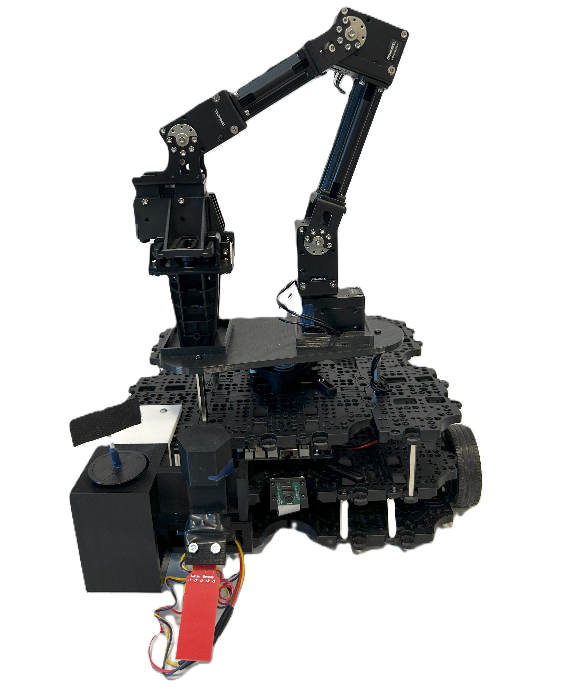

# General Information 
Several tables in this *README*-file have been copied from our masters thesis named "Framework for Modular Robotic System for Remote Liquid Classification and Sample Retrieval" to provide insight and clearity into the functions of this repository.  
This repository is a part of the documentation for MAS500 spring 2025 for group 3. 
The repository is forked from the repository combining the TurtleBot3 Waffle Pi robot platform with the OpenManipulator-X manipulator. 
This was done to share the changes made during development for MAS500 for the use of the robot platform and manipulator for autonomous deployment and liquid classification.
For this project, Ubuntu 22.04. and ROS2 Humble was used. 

Additional documentation can be found in the [Sphinx documentation](https://master-documentation-s25-gr3-405ee9.gitlab.io/index.html). 

#Changes and Additions to Hardware

For the thesis, several components have been changened or added. An overview of these main changes are below. 

| **Part**                       | **Attached With**                  | **Attached To**          | **3D Part Name**      | **Weight \[g]** |
| ------------------------------ | ---------------------------------- | ------------------------ | --------------------- | --------------- |
| Manipulator stand (level four) | Six screws, three support rods     | Top level (level three)  | `ManipulatorStand_P2` | 49              |
| Bracket                        | Two screws, two bolts              | Top level (level three)  | `Bracket_P3`          | 23              |
| Sample rack                    |                                    | Bracket                  | `SampelRack_P3`       | 59              |
| Sensor holder                  |                                    | Collection kit           | `Sensorholder_P3`     | 14              |
| Sensor                         | Two screws, two bolts, three wires | Sensor holder            |                       | 4               |
| Test tube                      |                                    | Collection kit           |                       | 7               |
| Q-tip with attachments         | q-tip lid                          | Test tube                |                       | 2               |
| Analog to digital converter    | Two screws, five wires             | Bottom level (level two) |                       | 4               |

# Changes and Additions to Repository

From the original repository, some changes have been made, mainly those in the table below. 

| **Name of Script**                   | **Description of Changes Made**                                           | **Location in GitHub Repository**                   |
| ------------------------------------ | ------------------------------------------------------------------------- | --------------------------------------------------- |
| `turtlebot3_manipulation.urdf.xacro` | Changed the position and orientation of the manipulator on the TurtleBot3 | `src/turtlebot3_manipulation_description/urdf/`     |
| `open_manipulator_x.urdf.xacro`      | Added more pre-defined positions for the manipulator                      | `src/turtlebot3_manipulation_description/urdf/`     |
| `turtlebot3_manipulation.srdf`       | Changed the limits of the opening of the gripper                          | `src/turtlebot3_manipulation_moveit_config/config/` |

In addition to this, some new files have been made and added. This includes the package *read_analog_sensor* with the execution script *adc_publisher.py*. An overview can be seen in the table below. 

| **Name of script**                 | **Description of function**                                                            | **Location in this GitHub repository**    |
| ---------------------------------- | -------------------------------------------------------------------------------------- | ----------------------------------------- |
| `Qtip_liquid_sample.cpp`           | Manipulator grabs the q-tip from test tube and takes a sample of liquid                | `src/turtlebot3_manipulator_mass500/scr/` |
| `ReadJointState.cpp`               | Saves the joint state if the detected liquid is outside the ranges for classification  | `src/turtlebot3_manipulator_mass500/scr/` |
| `Sensor_detect_liquid.cpp`         | Manipulator takes the sensor and several tests to locate the liquid relative to itself | `src/turtlebot3_manipulator_mass500/scr/` |
| `Sensor_liquid_classification.cpp` | Manipulator takes the sensor to classify the liquid at a predefined location           | `src/turtlebot3_manipulator_mass500/scr/` |
| `adc_publisher.py`                 | Publishes analog sensor signals                                                        | `src/analog_sensor/analog_sensor/`        |

The added package *read_analog_sensor*, which reads analog sensor signal and publishes it, is set up for the analog sensor Adafruit Industries LLC 4965 and the 12-bit ADC from Adafruit.  

# If Wanting to Use
*If wanting to use this repository for the TurtleBot3 Waffle Pi in combination with the OpenManipulator-X*: 
Follow the [guide](https://emanual.robotis.com/docs/en/platform/turtlebot3/quick-start/), but clone this repository instead of the one described when running the [manipulator and robot platform in tandem](https://emanual.robotis.com/docs/en/platform/turtlebot3/manipulation/#manipulation). 
Make sure to clone the other repositories and dowload packages as described by the guid. 

